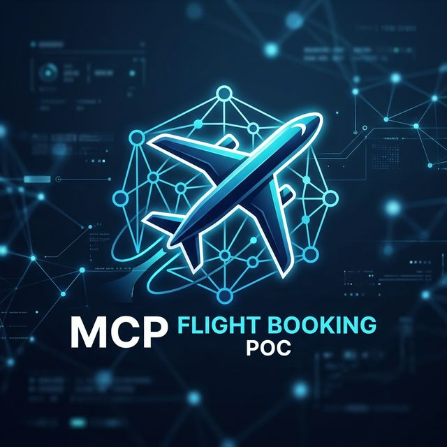
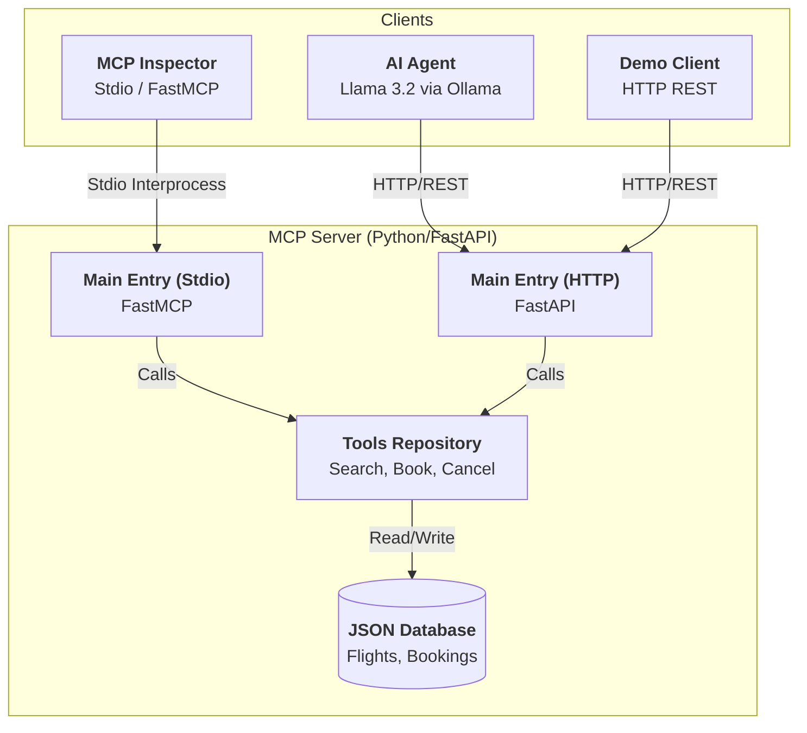

<p align="center">
  
</p>

# ✈️ MCP Flight Booking POC

[](https://www.python.org/downloads/)
[](https://modelcontextprotocol.io)
[](https://fastapi.tiangolo.com)
[](https://www.docker.com/)

A premium, end-to-end proof-of-concept demonstrating the **Model Context Protocol (MCP)**. This project enables AI models to search, book, and manage flights using a standardized protocol over both **Stdio** and **HTTP/REST**.

---

## 🏗 System Architecture

The project is split into a robust backend server and multiple clients that can interact with it via different transport methods:



---

## 🚀 Key Features

### 🛠 MCP Tools
The server exposes a set of actionable tools that any MCP-compliant client can use:
- `search_flights(origin, destination, date)`: Intelligent filtering of the flight catalog.
- `book_flight(flight_id, passenger_name)`: Atomic booking persistence.
- `cancel_booking(booking_id)`: Integrated booking lifecycle management.
- `list_bookings()`: Real-time retrieval of active reservations.

### 📝 MCP Prompts & Resources
- **Contextual Prompts**: Built-in templates with **Autocompletion** (e.g., search for "P" to get "Paris").
- **Exposed Resources**: Direct access to `flights://catalog` and `bookings://current` for data-heavy context without tool execution.

### 🤖 Interactive AI Agent
Includes a standalone AI Agent (`client/ai_agent.py`) that uses **Ollama** and **Llama 3.2** to reason about flight requests and autonomously invoke tools to fulfill user goals.

---

## ⚡ Quick Start (Docker)

Get everything up and running in under 2 minutes:

```bash
# 1. Clone/Unzip and enter the directory
cd mcp-flight-booking-poc

# 2. Start the Server (REST Mode)
docker-compose -f docker/docker-compose.yml up --build

# 3. Test with the Demo Client (New Terminal)
cd client
pip install httpx
python demo_client.py
```

---

## 🛠 Advanced Usage

### 🔍 Development with MCP Inspector
Inspect and debug the server interactively using-stdio mode:
```bash
npx @modelcontextprotocol/inspector python server/app/main.py
```

### 🧠 Running the AI Agent
Requires [Ollama](https://ollama.com/) with the `llama3.2` model installed.
```bash
# Start Ollama (if not already running)
# ollama serve

# In the client directory:
cd client
uv venv && source .venv/bin/activate
uv pip install -e .
python ai_agent.py
```

---

## 📂 Project Structure

| Component | Path | Description |
| :--- | :--- | :--- |
| **Server** | `server/` | Core MCP engine with FastAPI & FastMCP. |
| **Data** | `server/data/` | Mock JSON persistent store. |
| **Clients** | `client/` | Diverse client implementations (REST vs Agentic). |
| **Docker** | `docker/` | Production-ready multi-stage containerization. |
| **Docs** | `docs/` | Comprehensive guides and walkthroughs. |

---

## 🛡 Security
Local Stdio mode operates within a trusted shell. HTTP mode is secured via **API Key Middleware**.
- Default key: `DEMO_KEY` (Configured in `.env`).

## 📜 License
This project is licensed under the [MIT License](LICENSE).
